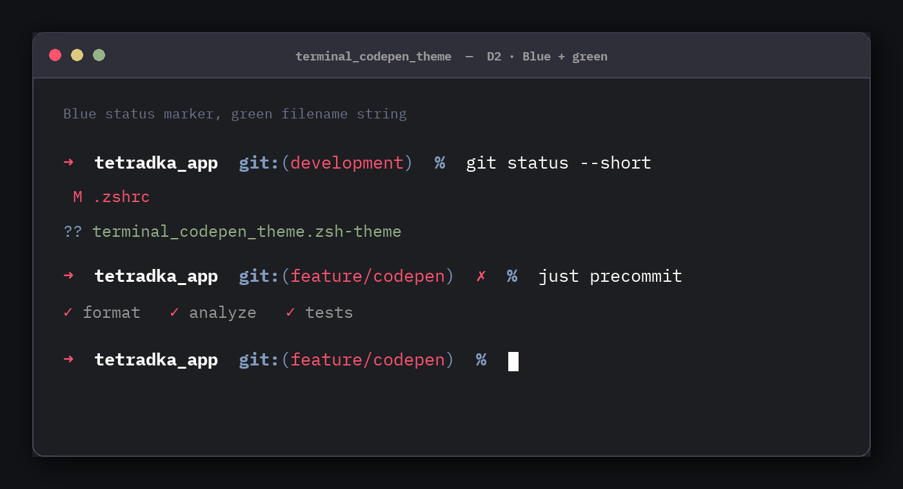
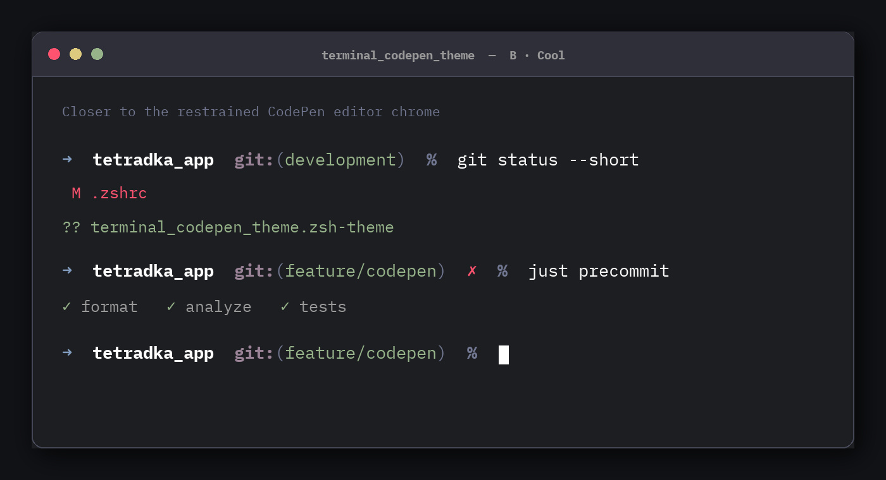

# terminal_codepen_theme

An Oh My Zsh theme and a macOS Terminal profile using the palette from
[VS Code CodePen Theme](https://github.com/ziqq/vscode_codepen_theme).

The default variant is the approved **D2** direction:

- red prompt arrow, Git branch, dirty mark, and tracked changes;
- white current directory and primary text;
- blue Git syntax and the `??` untracked marker;
- green untracked file paths.

The package also includes the cooler **B · Cool** prompt as `codepen_cool`.

## Previews

Default D2:



B · Cool:



## Install

### macOS Terminal profile

Import [`terminal/CodePen.terminal`](terminal/CodePen.terminal) by opening it in
Terminal.app:

```sh
open terminal/CodePen.terminal
```

Select **CodePen** in **Terminal → Settings → Profiles**. Use **Default** there
if new Terminal windows should always use the profile.

The profile defines the CodePen background, foreground, cursor, selection, and
all 16 ANSI colors. It is independent from the Oh My Zsh prompt theme below, so
the two can be used together or separately.

### Linux, macOS, WSL, or an existing MSYS2 shell

```sh
./install.sh
```

Use the Cool variant:

```sh
./install.sh --variant cool
```

The installer can install missing `zsh`, `git`, and `curl` packages through a detected package manager. To require
the prerequisites to exist already, pass `--skip-package-install`. Pass `--set-default-shell` only when you also want
the installer to run `chsh`.

### Windows PowerShell

```powershell
Set-ExecutionPolicy -Scope Process Bypass
.\install.ps1
```

The Windows installer finds or installs MSYS2, installs its Zsh prerequisites, and keeps the Zsh configuration under
the current Windows user profile. If MSYS2 lives elsewhere, pass `-Msys2Root 'D:\msys64'`.

```powershell
.\install.ps1 -Variant cool
```

Neither installer changes VS Code workspace settings.

## D2 Git status colors

Oh My Zsh themes control the prompt, not the output produced by Git. The optional top-level custom helper therefore
adds these shortcuts without replacing the `git` command:

```sh
gss   # D2-colored short status
gscp  # same explicit CodePen shortcut
```

The helper renders `??` in CodePen blue, the associated file path in CodePen green, and tracked changes in red.
Native commands such as `git status` and `git status --short` remain unchanged. Install without the helper using
`--no-git-helper` on Unix-like systems or `-NoGitHelper` in PowerShell.

## Command syntax colors

The Terminal.app profile controls the window and ANSI output. It cannot color
text while a command is being typed, so the installer also installs
[`zsh-syntax-highlighting`](https://github.com/zsh-users/zsh-syntax-highlighting)
and loads CodePen styles after Oh My Zsh. Commands are yellow, functions and
globbing are purple, paths and quoted arguments are green, aliases and
precommands are blue, comments are gray, and invalid tokens are red.

The syntax-highlighting integration is optional at runtime: if its plugin file
is unavailable, the prompt and Terminal.app profile still work normally.

## Fallback and files

The managed `.zshrc` block selects the requested CodePen theme only when its file is readable. Otherwise it selects
the built-in `robbyrussell` theme, so a missing custom theme does not break the prompt.

Installed files:

```text
${ZSH_CUSTOM:-$ZSH/custom}/themes/codepen.zsh-theme
${ZSH_CUSTOM:-$ZSH/custom}/themes/codepen_cool.zsh-theme
${ZSH_CUSTOM:-$ZSH/custom}/terminal-codepen-git-status.zsh
${ZSH_CUSTOM:-$ZSH/custom}/terminal-codepen-syntax.zsh
${ZSH_CUSTOM:-$ZSH/custom}/plugins/zsh-syntax-highlighting/
```

Before the first edit, the installer preserves an existing `.zshrc` as
`.zshrc.pre-terminal-codepen-theme`. Re-running the installer updates one managed block rather than adding duplicates.

## Sources

- Prompt conventions: [Oh My Zsh customization guide](https://github.com/ohmyzsh/ohmyzsh/wiki/Customization)
- Palette: [VS Code CodePen Theme](https://github.com/ziqq/vscode_codepen_theme)
- Terminal profile format: the profiles bundled with macOS Terminal.app
- Custom theme loading: [Oh My Zsh customization guide](https://github.com/ohmyzsh/ohmyzsh/wiki/Customization)
